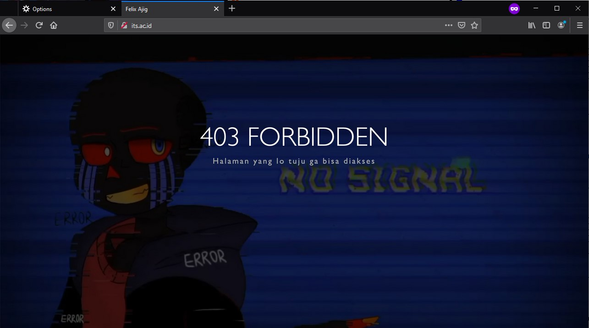

# Jarkom_Modul3_Praktikum_C14
### M Ridho Daffa Ardista 05111840000065
### Rifki Aulia Irawan 05111840000142

### 1. Membuat topologi jaringan
Jawab :
1. Setting topologi :
```# Switch
uml_switch -unix switch1 > /dev/null < /dev/null &
uml_switch -unix switch2 > /dev/null < /dev/null &
uml_switch -unix switch3 > /dev/null < /dev/null &

# Router
xterm -T SURABAYA -e linux ubd0=SURABAYA,jarkom umid=SURABAYA eth0=tuntap,,,10.$

# Server
xterm -T MALANG -e linux ubd0=MALANG,jarkom umid=MALANG eth0=daemon,,,switch2 m$
xterm -T MOJOKERTO -e linux ubd0=MOJOKERTO,jarkom umid=MOJOKERTO eth0=daemon,,,$
xterm -T TUBAN -e linux ubd0=TUBAN,jarkom umid=TUBAN eth0=daemon,,,switch2 mem=$

# Klien
xterm -T SIDOARJO -e linux ubd0=SIDOARJO,jarkom umid=SIDOARJO eth0=daemon,,,swi$
xterm -T GRESIK -e linux ubd0=GRESIK,jarkom umid=GRESIK eth0=daemon,,,switch1 m$
xterm -T BANYUWANGI -e linux ubd0=BANYUWANGI,jarkom umid=BANYUWANGI eth0=daemon$
xterm -T MADIUN -e linux ubd0=MADIUN,jarkom umid=MADIUN eth0=daemon,,,switch3 m$
```

2. Kemudian setelah melakukan perintah ```bash topologi.sh```, lakukan setting sysctl dengan mengetikkan perintah ```nano /etc/sysctl.conf```. Hilangkan tanda pagar (#) pada bagian ```net.ipv4.ip_forward=1```. Lalu jalankan ```sysctl -p``` untuk mengaktifkan perubahan yang ada.
  
3. lalu jalankan ```nano /etc/network/interfaces``` pada setiap UML, untuk konfigurasinya sebagai berikut :
### Surabaya (sebagai router)
```
auto lo
iface lo inet loopback

auto eth0
iface eth0 inet static
address 10.151.76.62
netmask 255.255.255.252
gateway 10.151.76.61

auto eth1
iface eth1 inet static
address 192.168.0.1
netmask 255.255.255.0

auto eth2
iface eth2 inet static
address 192.168.1.1
netmask 255.255.255.0

auto eth3
iface eth3 inet static
address 10.151.77.121
netmask 255.255.255.248
```
### Malang (sebagai DNS server)
```
auto lo
iface lo inet loopback

auto eth0
iface eth0 inet static
address 10.151.77.122
netmask 255.255.255.248
gateway 10.151.77.121
```
### Mojokerto (sebagai proxy server)
```
auto lo
iface lo inet loopback

auto eth0
iface eth0 inet static
address 10.151.77.123
netmask 255.255.255.248
gateway 10.151.77.121
```
### Tuban (sebagai DHCP server)
```
auto lo
iface lo inet loopback

auto eth0
iface eth0 inet static
address 10.151.77.124
netmask 255.255.255.248
gateway 10.151.77.121
```
### Sidoarjo, Banyuwangi, Madiun, dan Gresik (sebagai klien)
```
auto lo
iface lo inet loopback

auto eth0
iface eth0 inet dhcp
```
4. Pada setiap UML, jalankan ```service networking restart```
5. Pada setiap UML, jalankan ```nano /etc/apt/sources.list```, kemudian komen bagian yang mengandung kambing.ui lalu tambahkan ```deb http://boyo.its.ac.id/debian stretch main contrib non-free```
6. Lalu lakukan ```apt-get update``` pada tiap UML

### 2. Surabaya sebagai DHCP relay
Jawab :
1. pada UML SURABAYA, jalankan ```apt-get install isc-dhcp-relay```
2. lalu masukkan IP TUBAN, lalu enter
3. Masukkan eth1 eth2 eth3, lalu enter
4. Tekan enter lagi
5. Untuk mengecek konfigurasi, bisa dilihat dengan menjalankan ```nano /etc/default/isc-dhcp-relay```


### 3-6
1. Pada TUBAN, jalankan ```apt-get install isc-dhcp-server```
2. Jalankan ```nano /etc/default/isc-dhcp-server``` lalu masukkan pada bagian INTERFACE, "eth0"
  
3. lalu jalankan ```nano /etc/dhcp/dhcpd.conf```, kemudian tambahkan konfigurasi berikut di baris paling bawah
```subnet 10.151.77.120 netmask 255.255.255.248 {

}

subnet 192.168.0.0 netmask 255.255.255.0 {
    range 192.168.0.10 192.168.0.100;
    range 192.168.0.110 192.168.0.200;
    option routers 192.168.0.1;
    option broadcast-address 192.168.0.255;
    option domain-name-servers 10.151.77.122,202.46.129.2;
    default-lease-time 300;
    max-lease-time 300;
}

subnet 192.168.1.0 netmask 255.255.255.0 {
    range 192.168.1.50 192.168.1.70;
    option routers 192.168.1.1;
    option broadcast-address 192.168.0.255;
    option domain-name-servers 10.151.77.122,202.46.129.2;
    default-lease-time 600;
    max-lease-time 600;
}
```
4. Untuk soal no.3 terdapat pada bagian konfigurasi ```range 192.168.0.10 192.168.0.100;``` dan ```range 192.168.0.110 192.168.0.200;```  
5. untuk soal no.4 terdapat pada bagian konfigurasi ```range 192.168.1.50 192.168.1.70;```
6. untuk soal no.5 terdapat pada bagian konfigurasi ```10.151.77.122,202.46.129.2```
7. untuk soal no.6 terdapat pada bagian konfigurasi ```default-lease-time 300;``` dan ```max-lease-time 300;``` (untuk subnet 1) kemudian ```default-lease-time 600;``` dan ```max-lease-time 600;``` (untuk subnet 3)
 
8. Jalankan ```service isc-dhcp-server restart```
9. Pada keempat klien, jalankan ```service networking restart``` dan jalankan ```ifconfig``` lalu cek apakah sudah betul range IP nya
### Untuk GRESIK dan SIDOARJO (Subnet 1)


### Untuk BANYUWANGI dan MADIUN (Subnet 2)


### 7. Autentikasi
Jawab :
1. Pada UML MOJOKERTO jalankan ```htpasswd -c /etc/squid/passwd userta_c14``` kemudian masukkan passwordnya yaitu inipassw0rdta_c14
2. jalankan ```nano /etc/squid/squid.conf``` dan tambahkan konfigurasi berikut :
```
http_port 8080
visible_hostname mojokerto

auth_param basic program /usr/lib/squid/basic_ncsa_auth /etc/squid/passwd
auth_param basic children 5
auth_param basic realm Proxy
auth_param basic credentialsttl 2 hours
auth_param basic casesensitive on
acl USERS proxy_auth REQUIRED
http_access allow USERS
```
3. jalankan ```service squid restart```
4. lakukan setting proxy pada browser mozila firefox

5. Jika muncul tampilan autentikasi seperti dibawah, maka konfigurasi sudah benar


### 8-9 (REVISI) 
Jawab :
1. nano /etc/bind/named.conf.local
2. Tambahkan konfigurasi :  
```
zone "77.151.10.in-addr.arpa" {
    type master;
    file "/etc/bind/semeruc14/77.151.10.in-addr.arpa";
};
```  
  
3. cp /etc/bind/db.local /etc/bind/semeruc14/77.151.10.in-addr.arpa  
4. nano /etc/bind/semeruc14/77.151.10.in-addr.arpa  
5. Tambahkan konfigurasi :  
  
6. Service bind9 restart

### 10. redirect
Jawab :
1. Pada UML MOJOKERTO jalankan ```nano /etc/squid/restrict-sites.acl``` lalu tambahkan konfigurasi berikut
```www.google.com```


2. buka file squid.conf dengan perintah ```nano /etc/squid/squid.conf``` lalu tambahkan konfigurasi berikut
```	
acl blok-situs dstdomain "/etc/squid/restrict-sites.acl"
deny_info http://monta.if.its.ac.is/index.php/berita/lihatBerita blok-situs
http_access deny blok-situs
http_access deny all
``` 
3. jalankan ```service squid restart```
4. Pada browser Mozilla Firefox, coba masuk ke situs www.google.com, jika URL redirect menjadi monta.if.its.ac.id, maka konfigurasi sudah benar. 
  

### 11. mengubah tampilan halaman error
Jawab :
1. Pada UML MOJOKERTO buka direktori ```/usr/share/squid/errors/English```
2. Rename file error ERR_ACCESS_DENIED yang lama
3. Download file error yang baru dengan perintah ```wget 10.151.36.202/ERR_ACCESS_DENIED```
4. Jalankan ```service squid restart```  
5. Coba masuk ke situs its.ac.id, jika tampilan error seperti berikut, maka konfigurasi sudah benar


### 12. mengganti domain dengan janganlupa-ta.c14.pw (REVISI)
Jawab :
uml MOJOKERTO :
1. nano /etc/bind/delegasi/gunung.semeruc14.pw
2. Tambahkan konfigurasi :   
```	naik	IN	A	10.151.77.124 ```  
  
3. Service bind9 restart

### 8. Domain http://semeruc14.pw memiliki DocumentRoot pada /var/www/semeruc14.pw.
Jawab :
1. cd /etc/apache2/sites-available
2. cp /etc/apache2/sites-available/000-default.conf /etc/apache2/sites-available/semeruc14.pw.conf
3. nano /etc/apache2/sites-available/semeruc14.pw.conf
Tambahkan konfigurasi :  
  
4. a2ensite semeruc14.pw
6. wget 10.151.36.202/semeru.pw.zip
7. unzip semeru.pw.zip -d /var/www
8. mv /var/www/semeru.pw /var/www/semeruc14.pw
9. service apache2 restart

### 9. Mengaktifkan mod rewrite agar URL berubah menjadi http://​semeruc14.pw​/home
Jawab :
1. Aktifkan module rewrite dengan menjalankan perintah a2enmod
2. edit .htaccess pada /var/www/semeruc14.pw
3. tambahkan konfigurasi :  

4. jalankan service apache2 restart
5. Buka semeruc14.pw/home, maka akkan tampil halaman seperti berikut  


### 10. Web ​http://penanjakan.semeruyyy.pw​ akan digunakan untuk menyimpan assets file yangmemiliki ​DocumentRoot ​pada ​/var/www/​penanjakan.semeruc14.pw​ ​dan memiliki struktur folder sebagai berikut:
/var/www/penanjakan.semeruc14.pw  
/public/javascripts  
/public/css  
/public/images  
/errors  
Jawab :
1. Copy file 000-default.conf menuju penanjakan.semeruc14.pw.conf
2. Tambahkan konfigurasi pada file penanjakan.semeruc14.pw.conf seperti berikut  
```ServerName penanjakan.semeruc14.pw```  

3. jalankan a2ensite penanjakan.semeruc14.pw
4. jalankan service apache2 restart
5. download file pendukung untuk web penanjakan.semeruc14.pw yang disediakan di soal, kemudian unzip
6. rename file menjadi penanjakan.semeruc14.pw
7. jalankan service apache2 restart
8. coba buka penanjakan.semeruc14.pw, lalu akan muncul halaman dibawah  


### 11. Pada folder /public dibolehkan directory listing namun untuk folder yang berada di dalamnya tidak dibolehkan.
Jawab :
1. nano /etc/apache2/sites-available/penanjakan.semeruc14.pw.conf
2. tambahkan konfigurasi seperti berikut
```
<Directory /var/www/penanjakan.semeruc14.pw/public>
    Options +Indexes
</Directory>

<Directory /var/www/penanjakan.semeruc14.pw/public/*>
    Options -Indexes
</Directory>
```  
  
3. jalankan service apache2 restart
4. buka website penanjakan.semeruc14.pw dan coba buka masing-masing direktori yang ada, jika direktori public bisa diakses, dan css,javascripts,dan images tidak dapat diakses, maka berhasil.  
  
  
  


### 12. Untuk mengatasi HTTP Error code 404, disediakan file 404.html pada folder /errors untuk mengganti error default 404 dari Apache.
Jawab :
*(untuk penanjakan.semeruc14.pw)*
1. nano penanjakan.semeruc14.pw.conf
2. Tambahkan konfigurasi berikut  
```ErrorDocument 404 /errors/404.html```  
  
3. jalankan service apache2 restart
4. buka penanjakan.semeruc14.pw/asalaja, jika muncul tampilan seperti ini, maka sudah berhasil  


### 13. Untuk mengakses file assets javascript awalnya harus menggunakan url http://penanjakan.semeruc14.pw/public/javascripts. Karena terlalu panjang maka dibuatkan konfigurasi virtual host agar ketika mengakses file assets menjadi http://penanjakan.semeruc14.pw/js.
Jawab :
1. nano penanjakan.semeruc14.pw.conf
2. tambahkan konfigurasi berikut  
```Alias "/js" "/var/www/penanjakan.semeruc14.pw/public/javascripts"```  
  
3. buka direktori javascripts pada penanjakan.semeruc14.pw
4. jalankan touch app.js
5. jalankan service apache2 restart
6. buka pada browser penanjakan.semeruc14.pw/js, jika muncul seperti gambar berikut, maka sudah berhasil.  


### 14. Sedangkan web http://naik.gunung.semeruc14.pw sudah bisa diakses hanya dengan menggunakan port 8888. DocumentRoot web berada pada /var/www/naik.gunung.semeruc14.pw.
Jawab :
1. copy file 000-default.conf pada naik.gunung.semeruc14.pw.conf
2. buka file naik.gunung.semeruc14.pw.conf
3. pada bagian ```VirtualHost``` ganti portnya menjadi 8888, dan tambahkan konfigurasi berikut untuk mengganti documentroot menjadi /var/www/naik.gunung.semeruc14.pw  
  
 4. nano /etc/apache2/ports.conf
 5. tambahkan konfigurasi dibawah  
 ```Listen 8888```  
   
 6. pindah ke direktori /var/www, lalu download file pendukung untuk website naik.gunung.semeruc14.pw, lalu unzip
 7. rename file menjadi naik.gunung.semeruc14.pw
 8. jalankan a2ensite naik.gunung.semeruc14.pw
 9. jalankan service apache2 restart
 10. buka naik.gunung.semeruc14.pw pada broser, jika muncul seperti gambar dibawah, maka berhasil
   
 
 ### 15. Dikarenakan web http://naik.gunung.semeruc14.pw bersifat private, harus membuat web http://naik.gunung.semeruc14.pw agar diberi autentikasi password dengan username “semeru” dan password “kuynaikgunung”
 Jawab :
 1. tambahkan konfigurasi berikut pada pada 000-default.conf
 ```
 <Directory "/var/www/naik.gunung.semeruc14.pw">
    AuthType Basic
    AuthName "Restricted Content"
    AuthUserFile /etc/apache2/.htpasswd
    Require valid-user
 </Directory>
 ```  
   
 2. pada file /etc/apache2/apache2.conf, cari directory tag yang bertujuan ke /var/www, lalu ubah AllowOverride dari None ke All  
   
 3. jalankan ```htpasswd -c .htpasswd semeru``` untuk membuat username dan password, lalu masukkan password dan usernamenya
 4. tambahkan konfigurasi pada /var/www/naik.gunung.semeruc14.pw/.htaccess
 ```
 AuthType Basic
AuthName "Restricted Content"
AuthUserFile /etc/apache2/.htpasswd
Require valid-user
```
  
5. jalankan service apache2 restart
6. buka naik.gunung.semeruc14.pw:8888 pada browser, jika muncul seperti gambar dibawah, maka berhasil  
  
7. masukkan username dan password, jika benar maka akan masuk ke halaman berikut  


### 16. Karena dirasa kurang profesional, maka setiap Bibah mengunjungi IP PROBOLINGGO akan dialihkan secara otomatis ke http://semeruc14.pw.
Jawab :
1. tambahkan konfigurasi berikut pada file /etc/apace2/sites-available/000-default.conf
```
Redirect / "http://semeruc14.pw/"
```  
  
2. ketikkan IP Probolinggo pada browser, jika muncul halaman seperti berikut, maka sudah berhasil  
  

### 17. Karena pengunjung pada /var/www/penanjakan.semeruc14.pw/public/images sangat banyak maka semua request gambar yang memiliki substring “semeru” akan diarahkan menuju semeru.jpg.
Jawab :
1. nano /var/www/penanjakan.semeruc14.pw/.htaccess
2. Tambahkan konfigurasi :  
```
RewriteCond %{REQUEST_URI} !^/public/images/semeru.jpg
RewriteCond %{REQUEST_URI} ^/public/images/(.*)semeru(.*).jpg
RewriteRule ^ http://penanjakan.semeruc14.pw/public/images/semeru.jpg
```  
  
3. service apache2 restart  
  
  ### Kendala selama pengerjaan :
  1. Takut terkena segfault.
  2. Terkadang bingung untuk backtracking kesalahan dimana.
