# Jarkom_Modul3_Praktikum_C14
### M Ridho Daffa Ardista 05111840000065
### Rifki Aulia Irawan 05111840000142

### 1. Membuat topologi jaringan
Jawab :
1. Setting topologi :
```# Switch
uml_switch -unix switch1 > /dev/null < /dev/null &
uml_switch -unix switch2 > /dev/null < /dev/null &
uml_switch -unix switch3 > /dev/null < /dev/null &

# Router
xterm -T SURABAYA -e linux ubd0=SURABAYA,jarkom umid=SURABAYA eth0=tuntap,,,10.$

# Server
xterm -T MALANG -e linux ubd0=MALANG,jarkom umid=MALANG eth0=daemon,,,switch2 m$
xterm -T MOJOKERTO -e linux ubd0=MOJOKERTO,jarkom umid=MOJOKERTO eth0=daemon,,,$
xterm -T TUBAN -e linux ubd0=TUBAN,jarkom umid=TUBAN eth0=daemon,,,switch2 mem=$

# Klien
xterm -T SIDOARJO -e linux ubd0=SIDOARJO,jarkom umid=SIDOARJO eth0=daemon,,,swi$
xterm -T GRESIK -e linux ubd0=GRESIK,jarkom umid=GRESIK eth0=daemon,,,switch1 m$
xterm -T BANYUWANGI -e linux ubd0=BANYUWANGI,jarkom umid=BANYUWANGI eth0=daemon$
xterm -T MADIUN -e linux ubd0=MADIUN,jarkom umid=MADIUN eth0=daemon,,,switch3 m$
```

2. Kemudian setelah melakukan perintah ```bash topologi.sh```, lakukan setting sysctl dengan mengetikkan perintah ```nano /etc/sysctl.conf```. Hilangkan tanda pagar (#) pada bagian ```net.ipv4.ip_forward=1```. Lalu jalankan ```sysctl -p``` untuk mengaktifkan perubahan yang ada.
  
3. lalu jalankan ```nano /etc/network/interfaces``` pada setiap UML, untuk konfigurasinya sebagai berikut :
### Surabaya (sebagai router)
```
auto lo
iface lo inet loopback

auto eth0
iface eth0 inet static
address 10.151.76.62
netmask 255.255.255.252
gateway 10.151.76.61

auto eth1
iface eth1 inet static
address 192.168.0.1
netmask 255.255.255.0

auto eth2
iface eth2 inet static
address 192.168.1.1
netmask 255.255.255.0

auto eth3
iface eth3 inet static
address 10.151.77.121
netmask 255.255.255.248
```
### Malang (sebagai DNS server)
```
auto lo
iface lo inet loopback

auto eth0
iface eth0 inet static
address 10.151.77.122
netmask 255.255.255.248
gateway 10.151.77.121
```
### Mojokerto (sebagai proxy server)
```
auto lo
iface lo inet loopback

auto eth0
iface eth0 inet static
address 10.151.77.123
netmask 255.255.255.248
gateway 10.151.77.121
```
### Tuban (sebagai DHCP server)
```
auto lo
iface lo inet loopback

auto eth0
iface eth0 inet static
address 10.151.77.124
netmask 255.255.255.248
gateway 10.151.77.121
```
### Sidoarjo, Banyuwangi, Madiun, dan Gresik (sebagai klien)
```
auto lo
iface lo inet loopback

auto eth0
iface eth0 inet dhcp
```
4. Pada setiap UML, jalankan ```service networking restart```
5. Pada setiap UML, jalankan ```nano /etc/apt/sources.list```, kemudian komen bagian yang mengandung kambing.ui lalu tambahkan ```deb http://boyo.its.ac.id/debian stretch main contrib non-free```
6. Lalu lakukan ```apt-get update``` pada tiap UML

### 2. Surabaya sebagai DHCP relay
Jawab :
1. pada UML SURABAYA, jalankan ```apt-get install isc-dhcp-relay```
2. lalu masukkan IP TUBAN, lalu enter
3. Masukkan eth1 eth2 eth3, lalu enter
4. Tekan enter lagi
5. Untuk mengecek konfigurasi, bisa dilihat dengan menjalankan ```nano /etc/default/isc-dhcp-relay```
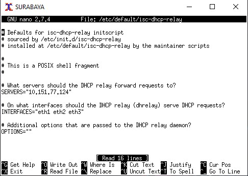

### 3-6
1. Pada TUBAN, jalankan ```apt-get install isc-dhcp-server```
2. Jalankan ```nano /etc/default/isc-dhcp-server``` lalu masukkan pada bagian INTERFACE, "eth0"
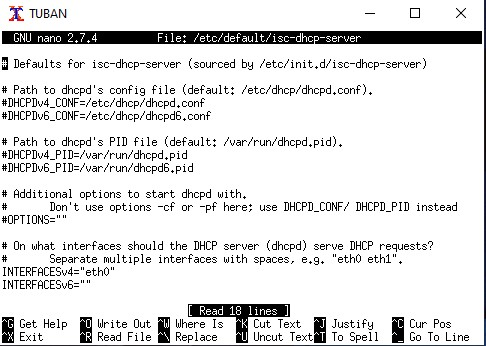  
3. lalu jalankan ```nano /etc/dhcp/dhcpd.conf```, kemudian tambahkan konfigurasi berikut di baris paling bawah
```subnet 10.151.77.120 netmask 255.255.255.248 {

}

subnet 192.168.0.0 netmask 255.255.255.0 {
    range 192.168.0.10 192.168.0.100;
    range 192.168.0.110 192.168.0.200;
    option routers 192.168.0.1;
    option broadcast-address 192.168.0.255;
    option domain-name-servers 10.151.77.122,202.46.129.2;
    default-lease-time 300;
    max-lease-time 300;
}

subnet 192.168.1.0 netmask 255.255.255.0 {
    range 192.168.1.50 192.168.1.70;
    option routers 192.168.1.1;
    option broadcast-address 192.168.0.255;
    option domain-name-servers 10.151.77.122,202.46.129.2;
    default-lease-time 600;
    max-lease-time 600;
}
```
4. Untuk soal no.3 terdapat pada bagian konfigurasi ```range 192.168.0.10 192.168.0.100;``` dan ```range 192.168.0.110 192.168.0.200;```  
5. untuk soal no.4 terdapat pada bagian konfigurasi ```range 192.168.1.50 192.168.1.70;```
6. untuk soal no.5 terdapat pada bagian konfigurasi ```10.151.77.122,202.46.129.2```
7. untuk soal no.6 terdapat pada bagian konfigurasi ```default-lease-time 300;``` dan ```max-lease-time 300;``` (untuk subnet 1) kemudian ```default-lease-time 600;``` dan ```max-lease-time 600;``` (untuk subnet 3)
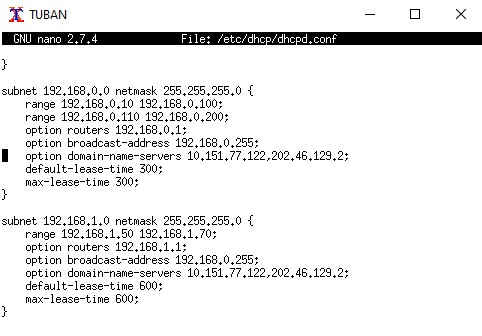 
8. Jalankan ```service isc-dhcp-server restart```
9. Pada keempat klien, jalankan ```service networking restart``` dan jalankan ```ifconfig``` lalu cek apakah sudah betul range IP nya
### Untuk GRESIK dan SIDOARJO (Subnet 1)
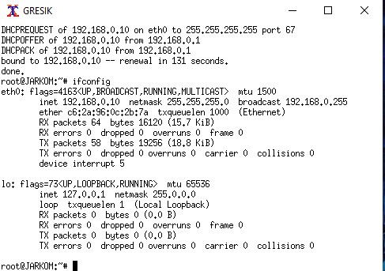
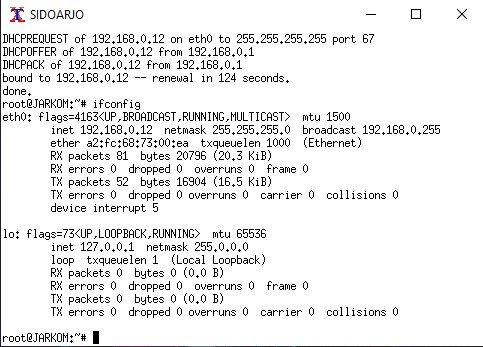
### Untuk BANYUWANGI dan MADIUN (Subnet 2)
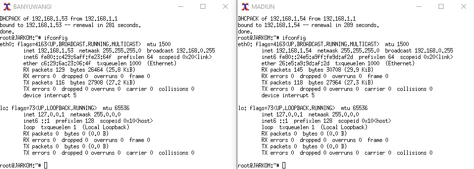

### 7. Autentikasi
Jawab :
1. Pada UML MOJOKERTO jalankan ```htpasswd -c /etc/squid/passwd userta_c14``` kemudian masukkan passwordnya yaitu inipassw0rdta_c14
2. jalankan ```nano /etc/squid/squid.conf``` dan tambahkan konfigurasi berikut :
```
http_port 8080
visible_hostname mojokerto

auth_param basic program /usr/lib/squid/basic_ncsa_auth /etc/squid/passwd
auth_param basic children 5
auth_param basic realm Proxy
auth_param basic credentialsttl 2 hours
auth_param basic casesensitive on
acl USERS proxy_auth REQUIRED
http_access allow USERS
```
3. jalankan ```service squid restart```
4. lakukan setting proxy pada browser mozila firefox
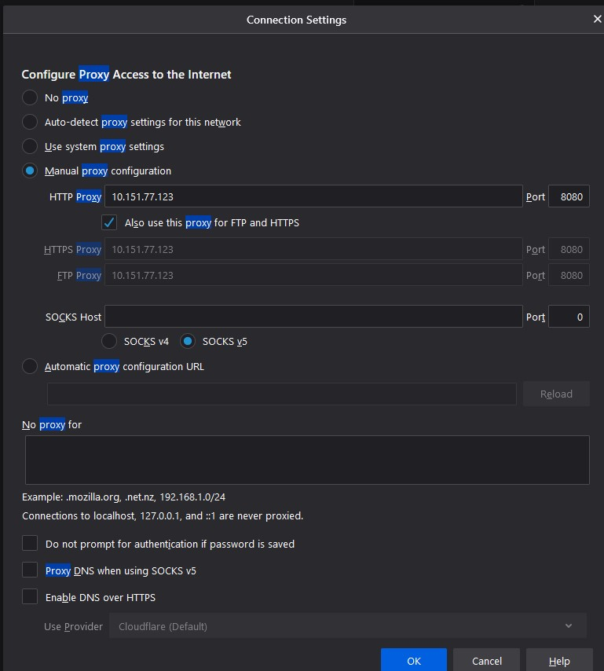
5. Jika muncul tampilan autentikasi seperti dibawah, maka konfigurasi sudah benar
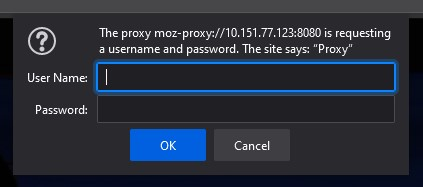

### 8-9 (REVISI) 
Jawab :
1. Pada UML MOJOKERTO, jalankan ```nano /etc/squid/acl.conf```
2. Tambahkan konfigurasi :  
```
acl AW time MAS 00:00-23:59
acl AW2 time TW 09:01-12:59
acl AW3 time TWH 18:01-20:59
acl AW4 time H 09:01-20:59
acl AW5 time F 09:01-23:59
```  
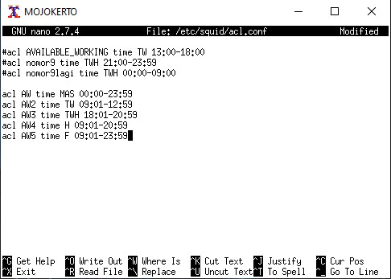 
Dilakukan setting berkebalikan sesuai no.8, yaitu untuk hari Selasa-Rabu pukul 13:00-18:00, dan untuk no.9 yaitu di hari Selasa-Kamis pukul 21:00-09:00  
3. lalu buka file squid.conf, dan tambahkan konfigurasi berikut
```
http_access deny AW
http_access deny AW2
http_access deny AW3
http_access deny AW4
http_access deny AW5 
```
4. Jika kita mengakses suatu halaman (misal its.ac.id) pada jam yang ada pada konfigurasi acl.conf, maka akan mengeluarkan tampilan error  
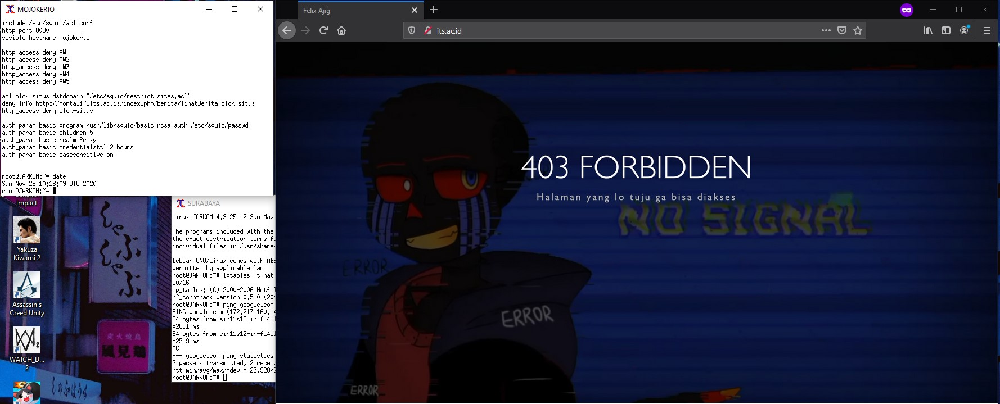  

### 10. redirect
Jawab :
1. Pada UML MOJOKERTO jalankan ```nano /etc/squid/restrict-sites.acl``` lalu tambahkan konfigurasi berikut
```www.google.com```
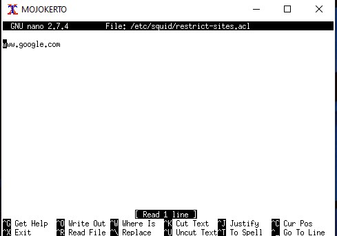

2. buka file squid.conf dengan perintah ```nano /etc/squid/squid.conf``` lalu tambahkan konfigurasi berikut
```	
acl blok-situs dstdomain "/etc/squid/restrict-sites.acl"
deny_info http://monta.if.its.ac.is/index.php/berita/lihatBerita blok-situs
http_access deny blok-situs
http_access deny all
``` 
3. jalankan ```service squid restart```
4. Pada browser Mozilla Firefox, coba masuk ke situs www.google.com, jika URL redirect menjadi monta.if.its.ac.id, maka konfigurasi sudah benar. 
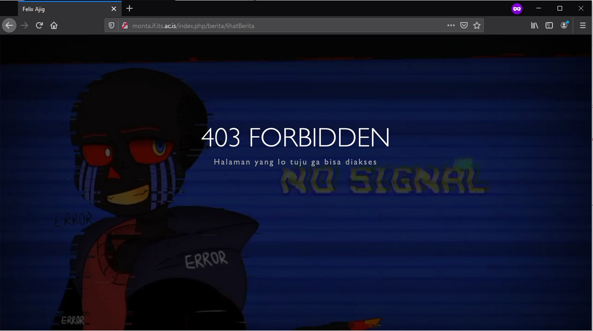  

### 11. mengubah tampilan halaman error
Jawab :
1. Pada UML MOJOKERTO buka direktori ```/usr/share/squid/errors/English```
2. Rename file error ERR_ACCESS_DENIED yang lama
3. Download file error yang baru dengan perintah ```wget 10.151.36.202/ERR_ACCESS_DENIED```
4. Jalankan ```service squid restart```  
5. Coba masuk ke situs its.ac.id, jika tampilan error seperti berikut, maka konfigurasi sudah benar
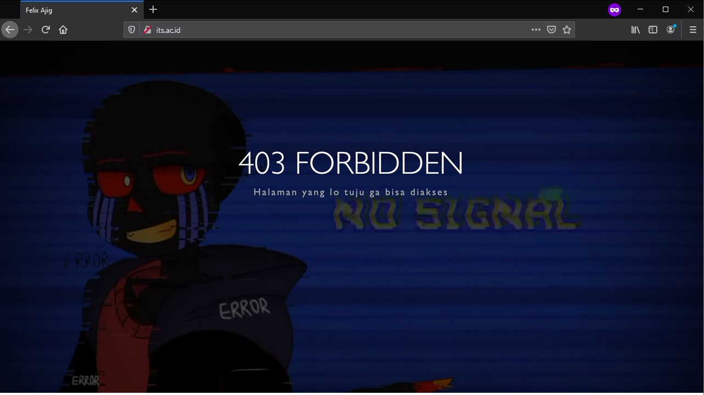

### 12. mengganti domain dengan janganlupa-ta.c14.pw
Jawab :
1. Pada UML MALANG, lakukan setting DNS Server terlebih dahulu, jalankan ```apt-get install bind9 -y```
2. Jalankan ```nano /etc/bind/named.conf.local```
3. Tambahkan konfigurasi seperti berikut 
```
zone "janganlupa-ta.c14.pw" {
        type master;
        file "/etc/bind/janganlupa/janganlupa-ta.c14.pw";
}; 
```  
4. Buat direktori bernama janganlupa
5. jalankan ```cp /etc/bind/db.local /etc/bind/janganlupa/janganlupa-ta.c14.pw```
6. jalankan ```nano /etc/bind/janganlupa/janganlupa-ta.c14.pw```
7. Tambahkan konfigurasi seperti gambar berikut  
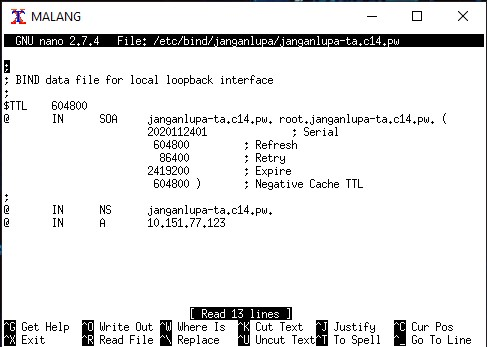
8. jalankan ```service bind9 restart```
9. Pada setting proxy mozilla, masukkan ```janganlupa-ta.c14.pw``` pada kolom "HTTP Proxy"
10. Coba masuk ke situs its.ac.id. Apabila bisa diakses, maka konfigurasi benar.
